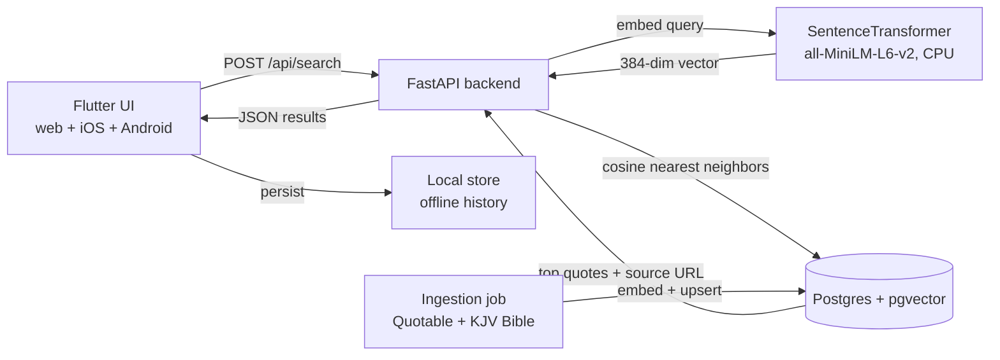

# Architecture

## Overview

The app turns a free-text input ("I'm scared to start something new") into the
best matching **real, attributable quote** with a link to its source. Matching is
done by *semantic similarity*, not keyword search, so meaning is matched even when
words differ.

## Why these technologies

| Concern | Choice | Reason |
| --- | --- | --- |
| Web + mobile, one codebase | **Flutter** | Real iOS/Android apps **and** a web build from a single Dart codebase; consistent UI everywhere. |
| Matching | **Embeddings + vector similarity** | Matches meaning, returns *existing* quotes (no LLM hallucination of fake quotes/attributions). |
| Vector store | **Postgres + pgvector** | One container is both relational DB and vector index. Simple to run and host. |
| Embeddings | **all-MiniLM-L6-v2 (384d)** | Small, fast on CPU. Quotes are embedded once; query embedding is a single fast call. |
| Backend | **FastAPI** | Minimal, async, great for serving an embedding + search endpoint. |
| Offline | **shared_preferences** | Stores past requests locally on all platforms for offline viewing. |

## Online vs. offline

- **Search is online only** — it needs the backend + vector DB.
- **Past requests are stored offline** on the device/browser. If the server is
  unreachable, the app shows previously returned quotes from local history.

## macOS + Docker GPU note

Docker Desktop on macOS runs containers in a Linux VM with **no access to the
Apple Silicon GPU/Metal**. This design sidesteps the issue: the embedding model
is small and runs **CPU-only**, which is fast enough here. If you later want a
larger local model, run it **natively** on macOS (e.g. Ollama) and have the
containerized backend call it over HTTP, rather than running it inside Docker.

## Quote sources

| Source | Content | Source link stored |
| --- | --- | --- |
| **Quotable API** | Politicians, writers, athletes, philosophers, etc. | Author's Wikiquote page |
| **KJV Bible (public domain JSON)** | Wisdom + gospel books by default | BibleGateway passage URL |

Both are attributed; every returned quote includes a clickable `source_url`.
Add more sources by writing another `fetch_*` function in
[`scripts/ingest.py`](../src/backend/scripts/ingest.py).
